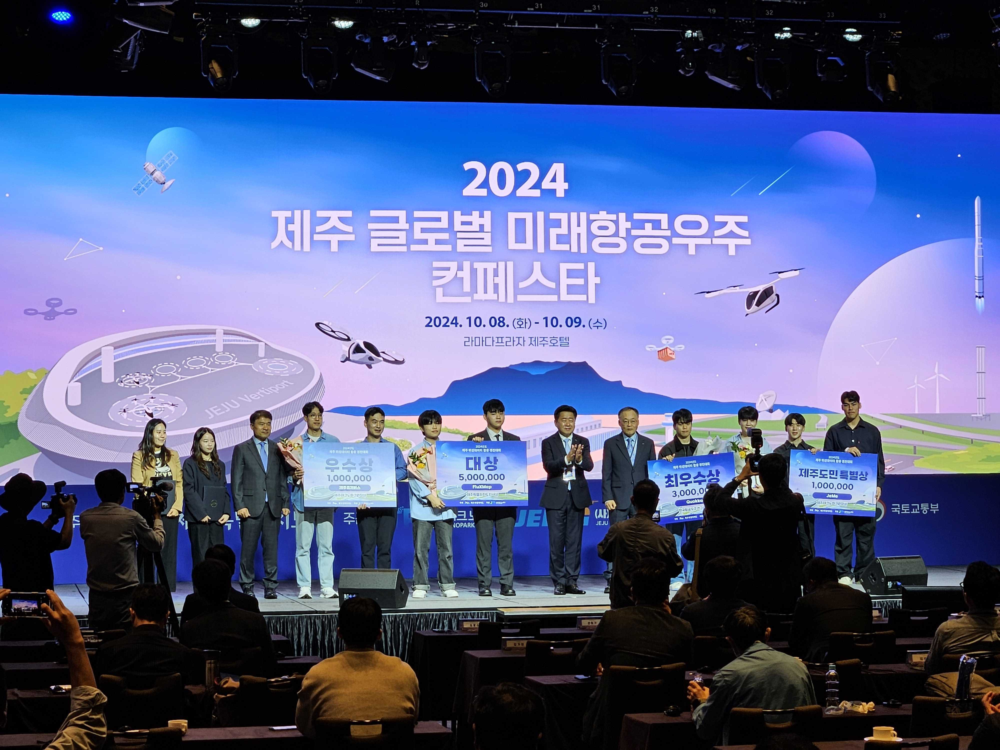

## About Me

I am an M.S. student at KAIST, currently in the [Computational Intelligence Laboratory](https://cilabs.kaist.ac.kr/) (Prof. Changick Kim). I earned a B.S. in Civil Engineering from Yonsei University, Seoul, and was a student intern at Seoul National University, working in both the [Vehicle Intelligence Laboratory](https://vi.snu.ac.kr/) (Prof. Seungwoo Seo) and the [Autonomous Robot Intelligence Laboratory](https://vi.snu.ac.kr/) (Prof. Seongwoo Kim). I worked as an AI Engineer at [Stellarvision](https://stellarvision.co.kr/en/), a satellite imagery startup. Also, I am founder of [XYZ Innovation](https://www.linkedin.com/company/xyzinnovation), a company focused on applying 3D Vision and Drone technologies to real-world challenges. These combined experiences have shaped my research interests.

## Education
* **[Present]** : M.S. in Engineering @KAIST Computaional Intelligence Laboratory
* **[Feb. 2025]** : B.S. in  Civil Engineering, AI Convergence @Yonsei University

## Research Interests

* **AIGC(AI Generated Contents) Detection:** Developing robust detection models for wild datasets (TikTok, YouTube Shorts, etc.) with focus on generalization across diverse AI-generated content types and social media platforms. [[arxiv'25]](https://arxiv.org/abs/2506.17592)
* **Spiking Neural Networks:** Investigating model compression and efficiency optimization using SNN architectures to reduce the performance gap between spiking and artificial neural networks while maintaining computational efficiency.[[IEIE'25(Best Paper)]](https://www.linkedin.com/posts/jadenjang_neuromorphiccomputing-visiontransformer-ai-activity-7348206102817189889-3Umd?utm_source=share&utm_medium=member_desktop&rcm=ACoAAEruz8kBUKyMdf_xZCXG6yIDp-BUSGMewOA)[[arxiv'25]](https://services.arxiv.org/html/submission/6674996/view) 
* **3D Digital Twin:** Creating comprehensive digital replicas by integrating UAV technology and remote sensing data for climate research applications, environmental monitoring, and atmospheric data analysis.
[[IEIE'24]](https://www.dbpia.co.kr/journal/articleDetail?nodeId=NODE11890368) 

## Work Experience

* **[Jul. 2024 ~ Feb. 2025]:** AI Engineer at [Stellarvision Inc.](https://stellarvision.co.kr/en/)

## Projects

* **[Apr. 2025 ~ Present]:** IITP - Technologies for On-Device AI Inter-Object Collaborative Behavior
* **[Apr. 2025 ~ Present]:** LIG Nex1 - Underwater sonar image enhancement
* **[Jun. 2025 ~ Sep. 2025]:** SOOMVI - Precise landing technology for drones
* **[Jul. 2024 ~ Feb. 2025]:** Stellarvision Inc - Sensor Fusion(SAR, LiDAR) UAV based Digital Twin Platform for landslides

## News

* **[Jun. 2025]** I awarded Best Paper at IEIE 2025 summer Conference.
* **[May. 2025]**: I have joined [GLG (Gerson Lehrman Group)](https://glginsights.com/ko/?utm_source=google&utm_medium=paid&utm_campaign=GLG%20BRAND&utm_term=glg&gad_source=1&gad_campaignid=21845526237&gclid=CjwKCAjw4K3DBhBqEiwAYtG_9FFCdtJ4EJE-E1SPtnAW7iV62W9dxZ5IUlwkiPAfuqOmnNErZj6MAxoCgygQAvD_BwE) as an advisory board member.
  


## Patents

* *LiDAR Micro Mobile Mapping System*, **Minsuk Jang** (KR Patent Application 10-2024-0130327)
* *Forest Carbon Sequestration Analysis System and Method*, **Minsuk Jang** (KR Patent Application 10-2024-0153987)
* *Vertically Takeoff and Landing Unmanned Aerial Vehicle with Adjustable Center of Gravity*, Minjun Kim, Junkyoo Park, Jungha Wang, **Minsuk Jang** (KR Patent Application 10-2024-0177539)
* *Method for Generating a High-Precision 3D Model from a Digital Elevation Model*, **Minsuk Jang**, Seungchul Lee (KR Patent Application 10-2024-0165631)
* *Machine Learning Clustering-Based Method for Algal Bloom Detection in Satellite Imagery*, **Minsuk Jang**, Seungchul Lee (KR Patent Application 10-2024-0165632)

  
## Awards & Honors

* **Best Paper Award** @ IEIE 2025 Summer Conference, May 2025
* **Seoul Drone Utilization Competition <strong>(Seoul Mayor's Award)</strong>** @ Seoul Metropolitan Government, Dec. 2024
* **Asan Nanum Foundation-Yonsei University Startup Competition <strong>(Excellence Prize)</strong>** @ Asan Nanum Foundation, Oct. 2024
* **Jeju Satellite Data Challenge <strong>(Grand Prize, Governor's Award)</strong>** @ Jeju Provincial Government, Sep. 2024
* **ICEE Challenge 2024 (Winner)** @ Yonsei University, Jul. 2024
* **Yonsei Student Council Idea Competition (Award Winner)** @ Yonsei University, Jul. 2024
* **Convergence Social Problem Solving Competition (Winner)** @ Yonsei University, Jan. 2024
* **2nd Command Center Drone Challenge (Winner)** @ Republic of Korea Army (ROKA)
* **Gyeonggi ESG Hackathon (Winner)** @ Gyeonggi-do Provincial Council
* **KSCE Civil Engineering Model Competition (Winner)** @ Korea Society of Civil Engineers
  

## Personal Projects

<!-- ─────────── Personal Projects (통일 버전) ─────────── -->

  

    <!-- DepthViz -->
    

      
<strong>DepthViz</strong>

      
A LiDAR scanner working on iPhone

      

        <a href="https://github.com/tersite1/DepthViz"
           target="_blank"
           class="project-button">Project Page</a>
        <a href="https://apps.apple.com/kr/app/simplepointcloudscan/id1617511625"
           target="_blank"
           class="download-button ios-button">Download&nbsp;(iOS)</a>
      

      

        <iframe src="https://www.youtube.com/embed/jtFA_WKWBDY"
                title="DepthViz Demo"
                frameborder="0"
                allowfullscreen></iframe>
      

    

    <!-- Yonsei Drone -->
    

      
<strong>Yonsei&nbsp;Drone</strong>

      
I'm still in Yonsei Drone, Wow!

      

        <a href="https://yonseidrone.notion.site/a9c169ae021445d0a5d95a083d69b1ad"
           target="_blank"
           class="project-button">Project Page</a>
        <a href="https://www.instagram.com/yonsei_drone/"
           target="_blank"
           class="instagram-button">Instagram</a>
      

      

        <iframe src="https://www.youtube.com/embed/iyjVVylZR5Q"
                title="Yonsei Drone Demo"
                frameborder="0"
                allowfullscreen></iframe>
      

    

    <!-- GreenWave (통일된 카드) -->
    

      
<strong>GreenWave</strong>

      

        I awarded Big Prize in Jeju! I beat Coupang and KAKAO, How?
      

      

        <a href="https://github.com/tersite1/GreenWave"
           target="_blank"
           class="project-button">Project Page</a>
        <a href="https://search.naver.com/search.naver?where=news&query=Fluxmap+녹조"
           target="_blank"
           class="news-button">News</a>
      

      <!-- 이미지도 기존 높이·라운드 그대로 맞춰줌 -->
      

        
      

    

  

## Academic Services

To be updated.

